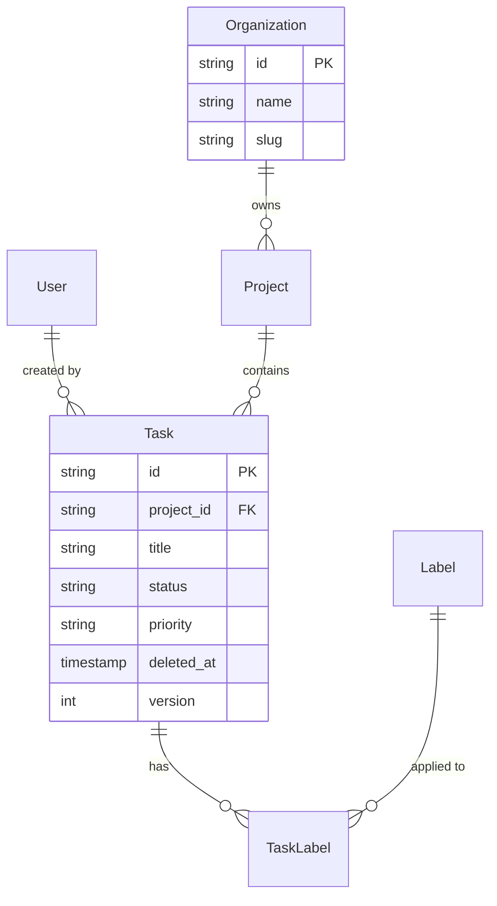

# Database Schema Designer

Design relational database schemas from requirements and generate migrations, types, seed data, RLS policies, and indexes. Handles multi-tenancy, soft deletes, audit trails, versioning, and polymorphic associations.

## Core Capabilities
- Schema design — normalize requirements into tables, relationships, constraints
- Migration generation — Drizzle, Prisma, TypeORM, Alembic
- Type generation — TypeScript interfaces, Python/Pydantic models
- RLS policies — Row-Level Security for multi-tenant apps
- Index strategy — composite, partial, covering indexes
- Seed data — realistic test data generation
- ERD generation — Mermaid diagrams from schema

## When to Use
- Designing a new feature that needs database tables
- Reviewing schema for performance or normalization issues
- Adding multi-tenancy to an existing schema
- Generating types from a Prisma/SQLAlchemy schema
- Planning a schema migration for a breaking change

## Schema Design Process

### Step 1: Requirements -> Entities
Extract nouns from requirements as tables:
> "Users create projects. Projects have tasks. Tasks can have labels assigned to users."
-> User, Project, Task, Label, TaskLabel (junction), TaskAssignment

### Step 2: Identify Relationships
```
User 1--* Project         (owner)
Project 1--* Task
Task *--* Label            (via TaskLabel)
Task *--* User            (via TaskAssignment)
```

### Step 3: Add Cross-cutting Concerns
- Multi-tenancy: add `organization_id` to tenant-scoped tables
- Soft deletes: `deleted_at TIMESTAMPTZ` instead of hard deletes
- Audit trail: `created_by`, `updated_by`, `created_at`, `updated_at`
- Versioning: `version INTEGER` for optimistic locking
- Timestamps: `created_at`, `updated_at` on every table

### Odoo-Specific Schema Design
- Use Odoo ORM fields instead of raw SQL tables
- Leverage `_inherit` for extending existing models
- Use `related` fields for computed relationships
- Implement soft delete via `active` field (default Odoo pattern)
- Multi-company via `company_id` Many2one field
- Use `_rec_name` for model display names
- Implement tracking via `track_visibility` on fields
- Use `_sql_constraints` for DB-level constraints
- Define indexes via `index=True` on frequently-filtered fields
- Leverage Odoo's `_order` for default sorting

### RLS / Record Rules (Odoo)
- Use ir.rule records for multi-company isolation
- Define group-based access via ir.model.access.csv
- Implement record-level rules with domain expressions
- Use `[('company_id','in',company_ids)]` for multi-company
- Separate create/read/write/unlink permissions per group

### Common Pitfalls
- Soft delete without index (WHERE deleted_at IS NULL = full scan)
- Missing composite indexes (WHERE org_id=? AND status=? needs composite)
- Mutable surrogate keys (never use email/slug as PK; use UUID/CUID)
- Non-nullable without default on existing table
- No optimistic locking (concurrent updates overwrite each other)
- RLS not tested with non-superuser role

### Best Practices
1. Timestamps everywhere: created_at, updated_at on every table
2. Soft deletes for auditable data: deleted_at instead of DELETE
3. Audit log for compliance: log before/after JSON for regulated domains
4. UUIDs/CUIDs as PKs: avoid sequential integer leakage
5. Index foreign keys: every FK column should have an index
6. Partial indexes: WHERE deleted_at IS NULL for active-only queries
7. RLS over application-level filtering: database enforces tenancy

### ERD Generation (Mermaid)

